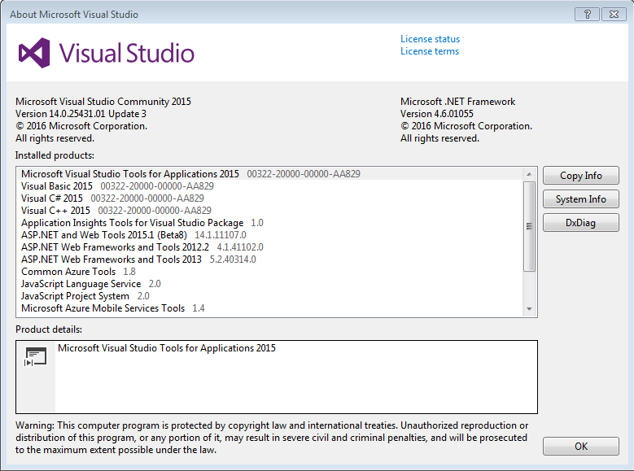

#Problems Overview
> There are 5 programming problems in this package. Each problem will approximately take 30 minutes to solve. You are allowed
> to use google for reference. Problem description can be found in the problem folder's readme.md file. *readme.md* files are markdown files that 
> are better viewed using google chrome's markdown viewer extension or under github/git repositories. If you are using markdown viewer for chrome make 
> sure to enable file url accessibility under markdown viewer's detail panel in chrome:///extension's. 

#Problems
<enter>
| Problem       | Description   |
| ------------- |:-------------:|
| Problem 1     | [readme](./Problems/Problem1/readme.md) |
| Problem 2     | [readme](./Problems/Problem2/readme.md) |
| Problem 3     | [readme](./Problems/Problem3/readme.md) |
| Problem 4     | [readme](./Problems/Problem4/readme.md) |
| Problem 5     | [readme](./Problems/Problem5/readme.md) |

#IDE requirments
> *testFramework* folder has the code and binaries for google mock and google test. These were compiled using 
> . 
> Community edition of visual studio is free to use as long as you have a http://outlook.com account.

#Troubleshooting library problems due to a mismatch in the development environment
##How to compile *testFramework* with a different visual studio
##compiling gtest
> Open [gtest solution](./testFramework/googletest-master/googletest/msvc/2010) solution in your visual studio and build the solution. 
> Ignore project conversion errors on open. 

##compiling gmock
> Open [gmock solution](./testFramework/googletest-master/googlemock/msvc/2015) solution in your visual studio and build solution. 
> Ignore project conversion errors on open.

#How to change problem settings to use the right gtest and gmock libraries
> If generated libraries are not gtest.lib or gmock.lib modify project settings .

#How to change problem settings to use the right gtest and gmock include and library directories
> If generated libraries are not in the right folder modify project setting's VC++ directories .

> If gtest and gmock sources are not in the right folder modify project setting's VC++ directories .

